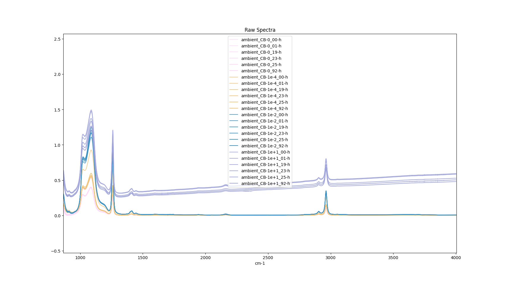
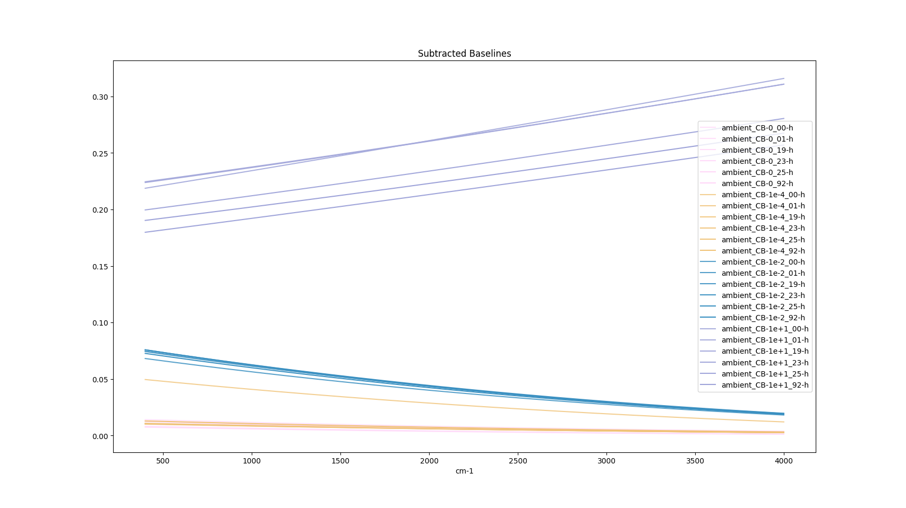
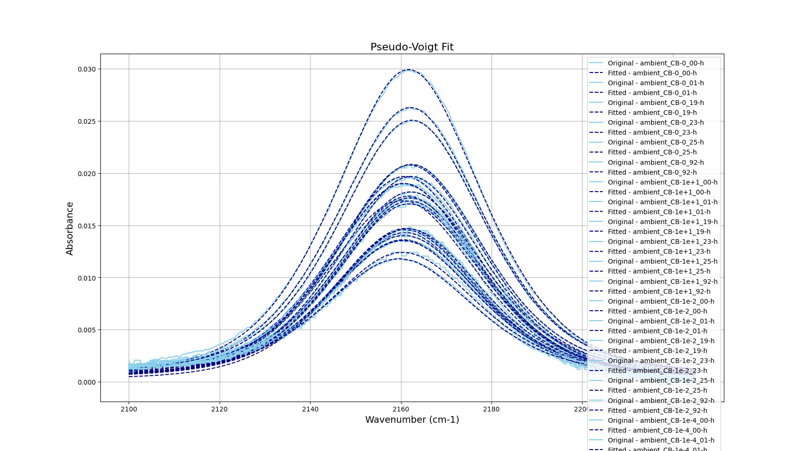
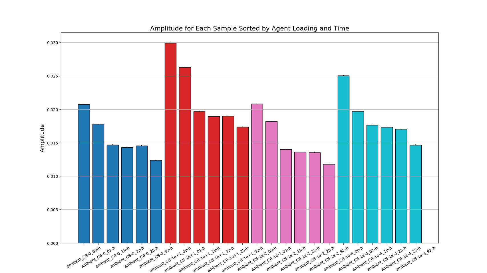
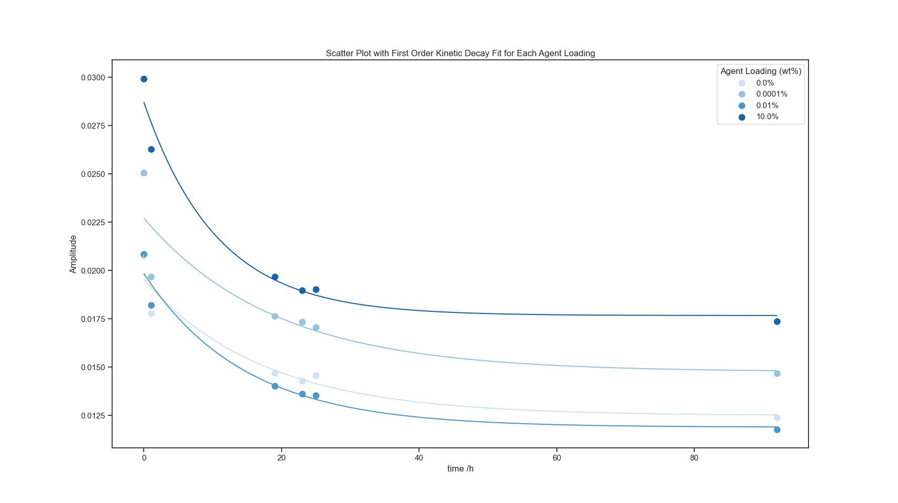
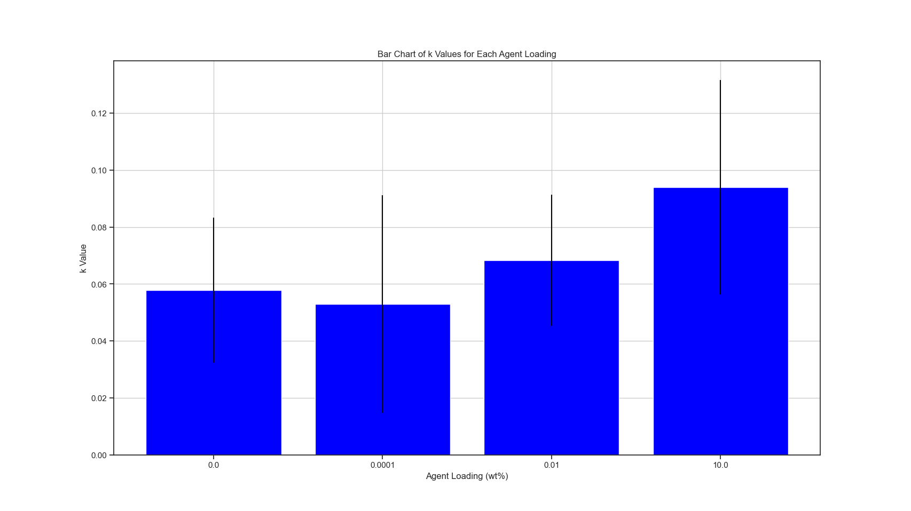
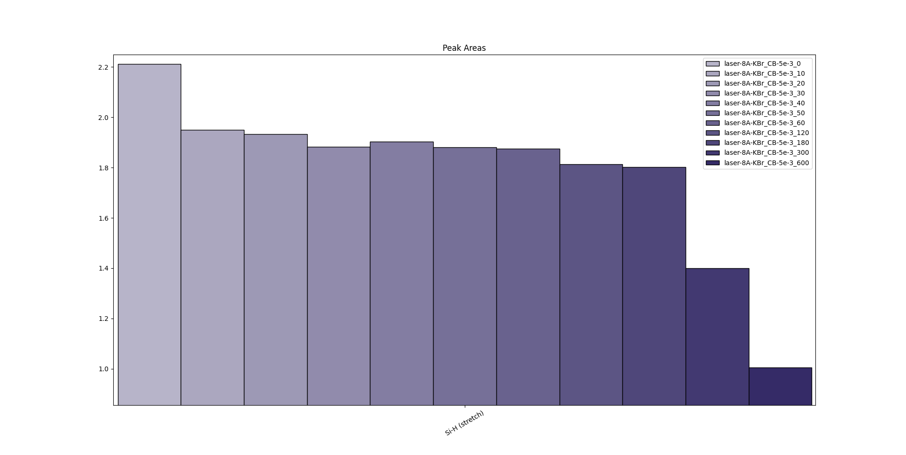
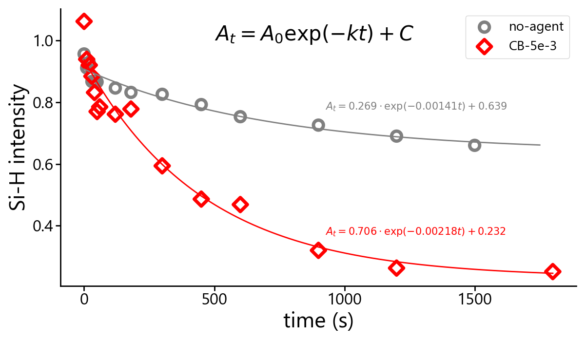

# IR CSV PDMS Kinetics Extractor

## to-do
- [ ] maintain time clustering in script 2's bar graph but sort by loading low to high
- [ ] finalize plot formatting and consistency (colors, titles, font, size, gridlines, etc.)
- [ ] try plotly graph replacements
- [x] propagate error from PV fit --> kinetic model fit --> k exponential model fit and output fit reports (see script 3, v2)
- [x] add error bars to kinetic model fit
- [x] use the PV scalar instead of the peak-wing difference
- [x] use lmfit to more easily extract error on the fit here as well as script 3
- [x] add error bars from lmfit to bar graph
- [x] modify to correct for tilt before baseline correction
- [x] find out why current naming convention isn't identified in color selection

## breakdown of 3-step script usage

1. accepts the path a folder of raw IR data CSV files, applies normalization and baseline correction, consolidates data and exports to a single separate CSV file, and graphically previews the original vs corrected spectra

2. accepts the path to the file exported from the 1st script, determines Si-H band value through pseudo-voigt fit, exports the values to a separate CSV file, and graphically previews the peek fit amplitude values vs time as well as printing the the pseudo-voigt fit parameters

3. accepts the path to the file exported from the 2nd script and plots kinetic model fits to the Si-H peak values

## example output (Dec 14, 2023 Data)

### script 1: correction and consolidation

")

")

### script 2: Si-H peak pseduo-voigt fitting

### script 3: kinetic model fitting

")

## deprecated

## to use:
1. format CSVs in input folder as follows: "cure-condition_agent-loading_time-unit.csv", e.g. "laser-15Wcm2_CB-5e-3_20-h.csv"
2. run scripts 1, 2, and 3 in order, using the file associated with each output in the following script

### notes
- shared functions found in the 'main.py' script
- cure extent determined through Si-H band pseudo-voigt amplitude
- functionality was segmented for debugging purposes but the separate outputs are also valuable independently and allow for more flexibility in  case-by-case analysis (you can try running from main.py but that will likely go unmaintained as of the implementation of kinetic fitting)
- caveats for measurement:
  - use spectra with the same number of samples across all files in a folder--i.e., files from varied wavelength ranges or resolutions are currently unsupported
  - be sure to include at least the baseline, normalization, and Si-H wavenumbers in the measurement (as of 8/22/23 meaning 1260 cm-1 to 3600 cm-1)

## General Graphing
- Spectra (raw)
- Spectra (corrected)
- Peak integrations vs time bar chart
- Si-H integration vs time kinetics-fit scatterplot

## dev to-do
 - 231208 data: didn't consider loading % vs fraction, fix these and standardize naming convention (add salt plate condition, get times in standard length, etc.)
   - modify script to extract time units from name (currently assumes seconds but this script uses hours)
 - confirm refactor usability
 - standardize the input csv convention (working version: "condition_time-in-s.csv", e.g. "5e-3_20.csv")
 - change the peak integration script to output a simplified format: time, condition 1, condition 2, etc.
 - procedurally check for conditions
  - cure (ambient, laser, oven) and photothermal agent (none, AuNP, CB)
 - replace color maps with condition conventions listed below
 - replace font in each step with segoe or similar
 - separate steps 
    - script 1: consolidate csv folder into a single csv with raw spectra, normalized spectra, and peak integrations and show plots
    - script 2: fit Si-H integrations from above dataframe to a A_t = A_0 e^(-kt) + C kinetic model, show plot, and export to csv
 - update example images in readme
 - extract/export other information from broader peak integration
  - variance of the standard groups other than the one normalized to (to show it's much smaller than Si-H)
  - how exactly does the Si-O-Si peak change with CB loading or other cure conditions?  both intensity and shifting seem apparent
### Graph formatting conditions (WiP):
cure-condition
- ambient
  - gray (#FFA500)
- laser
  - red (#FF0000)
- oven
  - blue (#1AA7EC)

agent-loading
- no-agent
  - circle
- AuNP
  - square
- 5e-3
  - upside-down triangle

Higher loading and temperatures --> darker (value? sat?), lightness floor at 0.25 (?)

  ### JS implementation considerations
- GUI (input file directory, graphs, wavenumber bounds, checkbox for included plot types and export)
    - directory fields (1: CSV folder, 2: output folder)
    - number field: controls to average over
    - checkboxes: Graphs (1: line, 2: bar), Bands (if bar selection, select all wanted to create)
    - buttons: 1: Run, 2: Export results CSV

### Considerations:
 - Resource: J Hofman's 2016 "IR Spectroscopic Method for Determiation of Silicone Cross-Linking"
 - Modified normalization for CB because of the Si-O-Si dependence on CB content

### Libraries:
os
glob
numpy
pandas
matplotlib.pyplot
simps